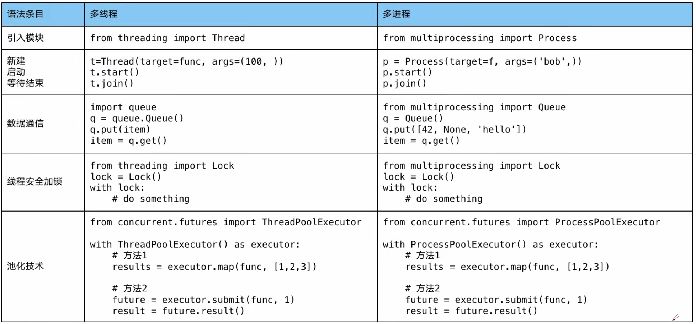

# Python并发编程 [undone]

>   Python解释器由于设计时有GIL全局锁，导致了多线程无法利用多核。多线程的并发在Python中就是一个美丽的梦。

## GIL锁

Python的线程虽然是真正的线程，但解释器执行代码时，有一个GIL锁(*Global Interpreter Lock*)，**任何**Python线程执行前，必须先获得GIL锁，然后，每执行100条字节码，解释器就自动释放GIL锁，让别的线程有机会执行。这个GIL全局锁实际上把所有线程的执行代码都给上了锁，所以，多线程在Python中只能交替执行，即使100个线程跑在100核CPU上，也只能用到1个核。

所以，Python 的线程更适用于处理**IO密集型**的**阻塞操作**（比如等待I/O、等待从数据库获取数据等等），而不是需要多处理器并行的计算密集型任务(即:**CPU密集型**)。

GIL是Python解释器设计的历史遗留问题，通常我们用的解释器是官方实现的CPython，要真正利用多核，除非**重写一个不带GIL的解释器**🤪 。

所以，在Python中，可以使用多线程，但不要指望能有效利用多核。如果一定要通过多线程利用多核，那只能通过C扩展来实现，不过这样就失去了Python简单易用的特点。

不过，也不用过于担心，Python虽然不能利用多线程实现多核任务，但可以通过**多进程实现多核任务**😕 。多个Python进程有各自独立的GIL锁，互不影响。

**总结**: `GIL锁`是Python解释器的特性,无法实现多核任务, 且短期内改不掉, 但是可以通过**多进程实现多核任务**.

## 多线程下IO密集型和cpu密集型对比总结

### 1. CPU密集型

一个**计算**为主的程序。多线程跑的时候，可以充分利用起所有的cpu核心，比如说4个核心的cpu,开4个线程的时候，可以同时跑4个线程的运算任务，此时是最大效率。
但是如果线程远远超出cpu核心数量反而会使得任务效率下降，因为频繁的切换线程也是要消耗时间的。
因此对于cpu密集型的任务来说，**线程数等于cpu数**是最好的了。

### 2. IO密集型

如果是一个**磁盘或网络**为主的程序（IO密集型）。一个线程处在**IO等待/阻塞**的时候，另一个线程还可以在CPU里面跑，有时候CPU闲着没事干，所有的线程都在等着IO，这时候他们就是同时的了，而单线程的话此时还是在一个一个等待的。我们都知道IO的速度比起CPU来是慢到令人发指的。所以开多线程，比方说多线程网络传输，多线程往不同的目录写文件，等等。此时线程数等于IO任务数是最佳的。

## 多线程编程

#### 普通多线程编程

使用`threading`模块创建`Thread`实例, 然后调用`start()`开始执行

```python
import threading, time

def do_something(i):
    print(f"Start doing {i}")
    time.sleep(2)
    print(f"End doing {i}")
    return True

def main():
    threads = []
    for i in range(10):
        this_threading = threading.Thread(target=do_some_thing, args=(i, ))
        # 调用`start()`开始执行
        this_threading.start()
        threads.append(this_threading)

    print("___主线程开始🔛___")

    # 调用`thread.join()`的作用是确保子线程执行完毕后才能执行下一个线程
    for thread in threads:
        thread.join()

    print("___主线程结束🔚___")

if __name__ == '__main__':
    main()
```

#### 加锁保证线程安全

>   "当多个线程同时执行`lock.acquire()`时，只有一个线程能成功地获取锁，然后继续执行代码，其他线程就继续等待直到获得锁为止。获得锁的线程用完后一定要释放锁，否则那些苦苦等待锁的线程将永远等待下去，成为死线程。所以我们用`try...finally`来确保锁一定会被释放。"
>
>   锁的作用是确保某段关键代码只能由一个线程从头到尾完整地执行，坏处当然也很多，首先是阻止了多线程并发执行，包含锁的某段代码实际上只能以单线程模式执行，效率就大大地下降了。其次，由于可以存在多个锁，不同的线程持有不同的锁，并试图获取对方持有的锁时，可能会造成**死锁**，导致多个线程全部挂起，既不能执行，也无法结束，只能靠操作系统强制终止。

- 方案1: try-finally 模式

```python
import threading, time
lock = threading.Lock()

def do_something(i):
    lock.acquire()
    try:
        print(f"Start doing {i}")
        time.sleep(2)
        print(f"End doing {i}")
    finally:
        lock.release()
    return True

def main():
    threads = []
    for i in range(10):
        this_threading = threading.Thread(target=do_something, args=(i, ))
        # 调用`start()`开始执行
        this_threading.start()
        threads.append(this_threading)

    print("___主线程开始🔛___")

    # 调用`thread.join()`的作用是确保子线程执行完毕后才能执行下一个线程
    for thread in threads:
        thread.join()

    print("___主线程结束🔚___")

if __name__ == '__main__':
    main()
```

- 方案2: with模式

```python
import threading, time
lock = threading.Lock()

def do_something(i):
    with lock:
        print(f"Start doing {i}")
        time.sleep(2)
        print(f"End doing {i}")
    return True

def main():
    threads = []
    for i in range(10):
        this_threading = threading.Thread(target=do_something, args=(i, ))
        # 调用`start()`开始执行
        this_threading.start()
        threads.append(this_threading)

    print("___主线程开始🔛___")

    # 调用`thread.join()`的作用是确保子线程执行完毕后才能执行下一个线程
    for thread in threads:
        thread.join()

    print("___主线程结束🔚___")

if __name__ == '__main__':
    main()
```

## 线程池(*ThreadPoolExecutor*) For `Python3.2+`

>   从`Python3.2`开始，标准库为我们提供了`concurrent.futures`模块，它提供了`ThreadPoolExecutor`和`ProcessPoolExecutor`两个类，实现了对`threading`和`multiprocessing`的进一步抽象

可以帮我们**自动调度线程**，还可以做到：
1.  主线程可以获取某一个线程（或者任务的）的状态，以及返回值。
2.  当一个线程完成的时候，主线程能够立即知道。
3.  让多线程和多进程的编码接口一致。


<p style="color:red">TODO...</p>


## 总结: 



## 协程(*Coroutine*)

子程序调用是通过栈实现的，一个线程就是执行一个子程序。
子程序调用总是一个入口，一次返回，调用顺序是明确的。而协程的调用和子程序不同。
协程看上去也是子程序，但执行过程中，**在子程序内部可中断**，然后转而执行别的子程序，在适当的时候再返回来接着执行。


<p style="color:red">TODO...</p>


#### 参考链接:

- 廖雪峰官方网站: https://www.liaoxuefeng.com/wiki/1016959663602400/1017968846697824
- 简书: https://www.jianshu.com/p/b9b3d66aa0be
- B站: 

